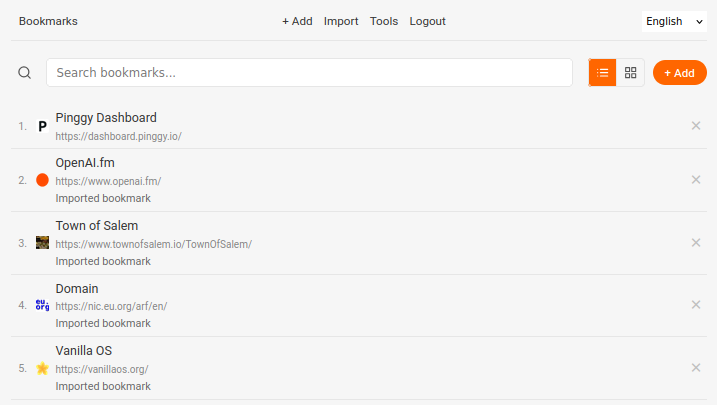
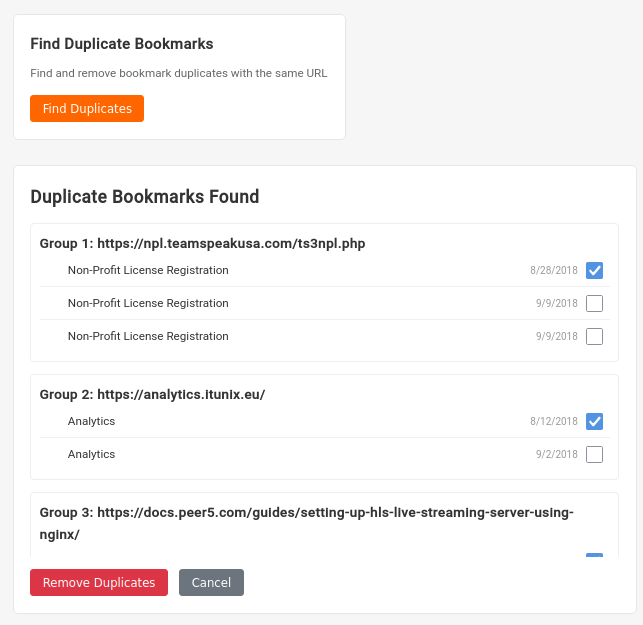
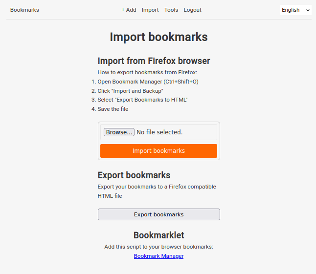

# Bookmark Manager

A powerful, lightweight web application for organizing, storing, and managing your bookmarks with an intuitive user interface.

## Features

- **Personal Bookmark Repository**: Store all your bookmarks in one place with secure user accounts
- **Search Functionality**: Quickly find bookmarks with real-time search
- **Import & Export**: Import bookmarks from Firefox HTML exports and export them in the same format
- **Automatic Favicon Fetching**: Visual recognition with website favicons automatically fetched for each bookmark
- **Duplicate Detection**: Find and remove duplicate bookmarks
- **Multi-language Support**: Available in English, Polish, and German with easy extensibility to other languages
- **Responsive Design**: User-friendly interface that works on both desktop and mobile devices

## Screenshots





## Installation

### Prerequisites

- Python 3.7 or higher
- pip (Python package manager)

### Setup

1. Clone the repository
   ```bash
   git clone https://github.com/skorotkiewicz/bookmarks
   cd bookmarks
   ```

2. Create and activate a virtual environment
   ```bash
   python3 -m venv venv
   source venv/bin/activate  # On Windows: venv\Scripts\activate
   ```

3. Install dependencies
   ```bash
   pip install -r requirements.txt
   ```

4. Run the application
   ```bash
   # Development mode
   python app.py dev
   
   # Production mode
   python app.py
   ```

5. Access the application at http://localhost:5000

## Usage

1. **Register/Login**: Create an account or log in to an existing one
2. **Adding Bookmarks**: Click the "+ Add" button to manually add a new bookmark
3. **Importing Bookmarks**: Import your browser bookmarks using the "Import" option
4. **Searching**: Use the search icon to find bookmarks by title or URL
5. **Managing Duplicates**: Remove duplicate bookmarks using the "Tools" section

## Internationalization

The application supports multiple languages. Currently implemented:
- English (en)
- Polish (pl)
- German (de)

To add a new language:
1. Create a new translation file in the `lang/` directory (e.g., `fr.json`)
2. Copy the structure from an existing language file and translate all values
3. Add the language code to the `LANGUAGES` list in `app.py`:
   ```python
   app.config['LANGUAGES'] = ['en', 'pl', 'de', 'fr']
   ```

## Development

### Project Structure

- `app.py`: Main application file with all routes and database models
- `lang/`: Language translation files
- `static/`: Static assets (CSS, JS, images)
- `templates/`: HTML templates
- `instance/`: Contains the SQLite database file

### Database Schema

- **User**: Stores user credentials and relationships to bookmarks
- **Bookmark**: Stores bookmark information including title, URL, description, and creation date

## Deployment

For production deployment, the application uses Waitress as a WSGI server:

```bash
python app.py  # This automatically uses Waitress in production mode
```

For custom deployment configuration, modify the server settings in the `app.py` file.

## License

[MIT License](https://github.com/skorotkiewicz/bookmarks/blob/del/LICENSE)

## Acknowledgements

- Flask web framework
- SQLAlchemy ORM
- BeautifulSoup for HTML parsing
- Waitress WSGI server